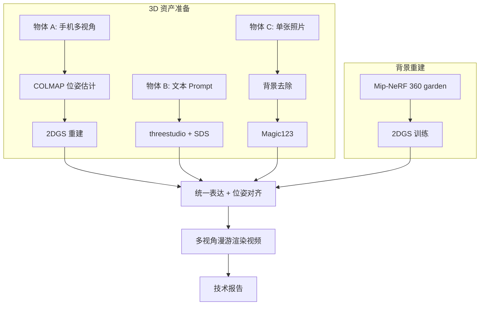

# 任务拆解与执行指南

## 一、整体流程图



## 二、分任务详解

### 任务 1.1 — 物体 A（多视角真实重建）

**目标**：从真实物体得到 2DGS 表示（与背景同格式，便于融合）。

**数据采集要点**：
- 物体占画面 60–80%，背景尽量简单
- 环绕 360°，仰角 ±30°，相邻视角重叠 >60%
- 50–100 张即可；视频抽帧也可（每秒 2–3 帧）

**技术链路**：
1. COLMAP：`feature_extractor` → `exhaustive_matcher` → `mapper` → `model_converter`（输出 `sparse/0`）
2. 2DGS：将 COLMAP 结果转为 2DGS 格式，训练 7k–15k iterations

**验收标准**：
- 新视角合成 PSNR > 25（物体级）
- 无明显 floaters、背景泄漏

---

### 任务 1.2 — 物体 B（文本生成 3D）

**目标**：用 threestudio + SDS 从 prompt 生成虚拟物体。

**推荐配置**：
- 系统：`dreamfusion` 或 `magic3d`
- 骨干：Stable Diffusion 1.5 / DeepFloyd IF
- Prompt 示例：`a cute ceramic mug with blue stripes, studio lighting, high quality 3D object`

**输出**：
- 训练中间 checkpoint（NeRF/SDF）
- 导出带纹理 Mesh：`outputs/object_b/mesh.obj` + `mesh.mtl` + 贴图

**注意**：SDS 物体常有背面空洞，需在报告中说明并展示多视角。

---

### 任务 1.3 — 物体 C（单图生成 3D）

**目标**：单张手机照片 → 抠图 → Magic123 → 3D Mesh。

**预处理**：
```bash
python scripts/utils/remove_bg.py --input data/object_c/photo.jpg --output data/object_c/input.png
```
可用 rembg 或手动 Photoshop 抠图。

**Magic123 流程**：
1. 配置参考图路径
2. 运行 coarse + fine 两阶段
3. 导出 `.obj` / `.glb`

**验收**：物体主体完整，背面合理补全（允许轻微幻觉）。

---

### 任务 2 — 背景场景（Mip-NeRF 360 + 2DGS）

**数据集**：https://storage.googleapis.com/gresearch/refraw360/360_v2.zip

推荐场景：`garden`（室外，便于放置三个物体）

**步骤**：
1. 下载并解压到 `data/background/garden/`
2. 运行 `scripts/04_background_2dgs.sh`
3. 得到 `outputs/background/point_cloud.ply`

**训练建议**：
- iterations: 30k
- 分辨率：先 1/2 分辨率快速验证，再全分辨率出最终结果

---

### 任务 3 — 场景融合与渲染

**核心问题**：背景是 2DGS（显式高斯面片），B/C 是 Mesh，A 是 2DGS。

**本仓库采用方案**：**Mesh → 点云采样 → 伪高斯 → PLY 合并**（代码级拼接）

| 资产 | 原始格式 | 融合前转换 |
|------|----------|------------|
| 背景 | 2DGS PLY | 保持不变 |
| 物体 A | 2DGS PLY | 应用 Sim(3) 变换后合并 |
| 物体 B | Mesh | `mesh_to_gaussians.py` → PLY |
| 物体 C | Mesh | 同上 |

**位姿配置**：编辑 `configs/scene_layout.yaml`，在 Blender 或 MeshLab 中目测调整 scale/translation。

**渲染**：用 2DGS 官方 `render.py` 沿圆形相机轨迹出 120 帧，ffmpeg 合成 MP4。

---

### 任务 4 — 质量评估与技术报告

见 `report/TECHNICAL_REPORT.md`，需包含：

1. **三方法对比**（几何准确度、纹理细节、计算耗时）
2. **统一表达与合并渲染**的详细实现说明
3. 超参数表、训练曲线（WandB/SwanLab 截图）
4. 融合场景截图与漫游视频链接

## 三、时间规划（建议 2 周）

| 天数 | 内容 |
|------|------|
| D1–D2 | 拍摄物体 A/C，下载 garden，搭环境 |
| D3–D4 | COLMAP + 2DGS 物体 A |
| D5 | threestudio 物体 B |
| D6 | Magic123 物体 C |
| D7–D9 | 2DGS 背景（可挂机） |
| D10 | 融合、调位姿、出视频 |
| D11–D12 | 写报告、整理 GitHub、上传 Drive |

## 四、常见踩坑

1. **COLMAP 失败**：检查图像 EXIF 是否被旋转；用 `--SiftExtraction.use_gpu 1`
2. **2DGS 全黑**：相机坐标系与 COLMAP 不一致，检查 `images/` 软链接
3. **threestudio OOM**：降低 batch size，用 `magic3d-coarse` 先粗后细
4. **Magic123 环境冲突**：单独 conda 环境，PyTorch 版本与 threestudio 分开
5. **融合尺度不对**：在 Blender 中导入背景点云（可用插件）和 Mesh，目视对齐后再写 yaml
