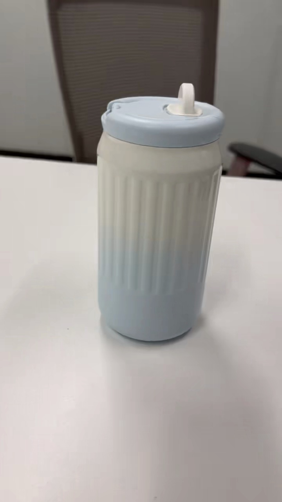
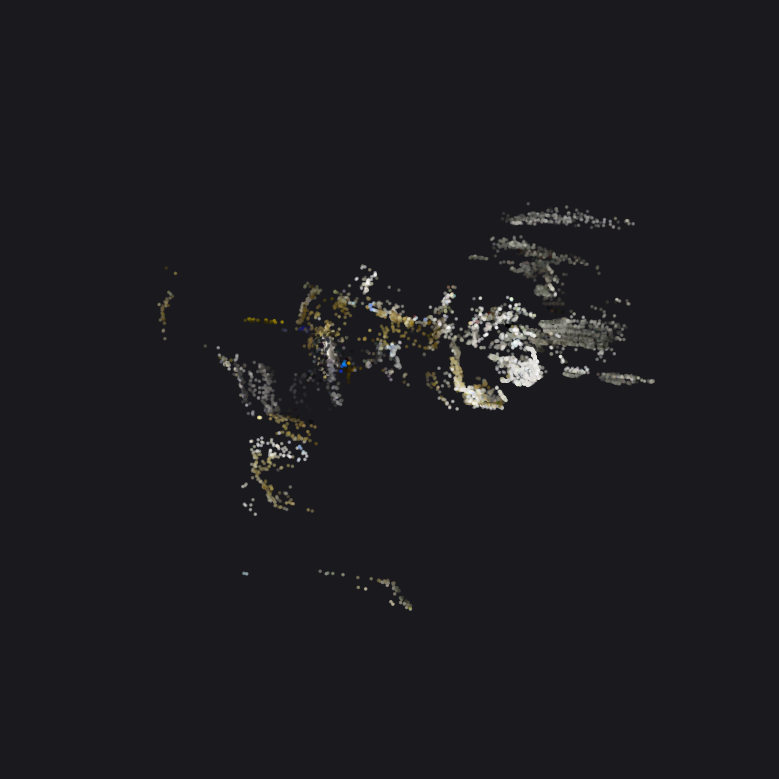
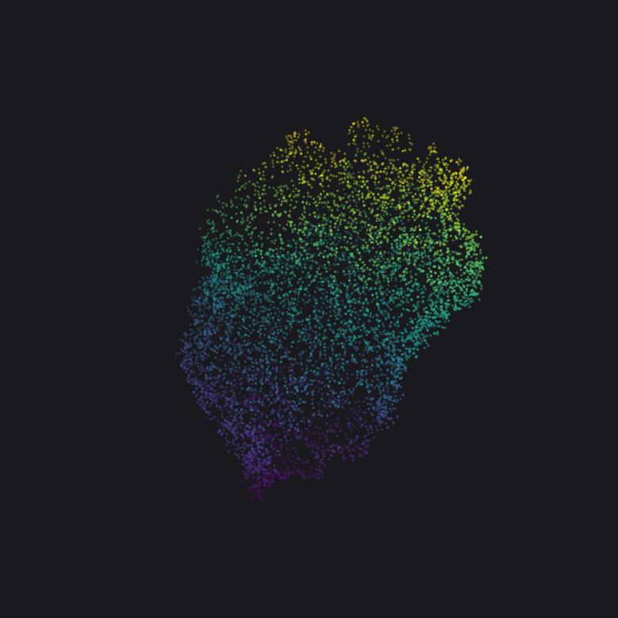
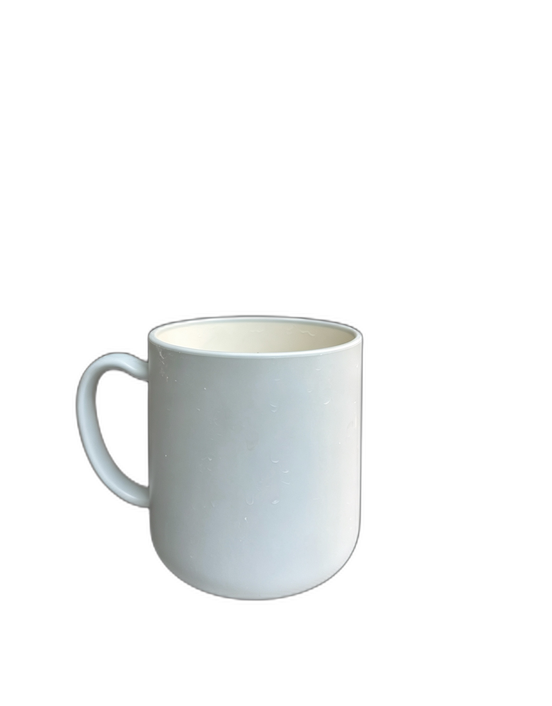
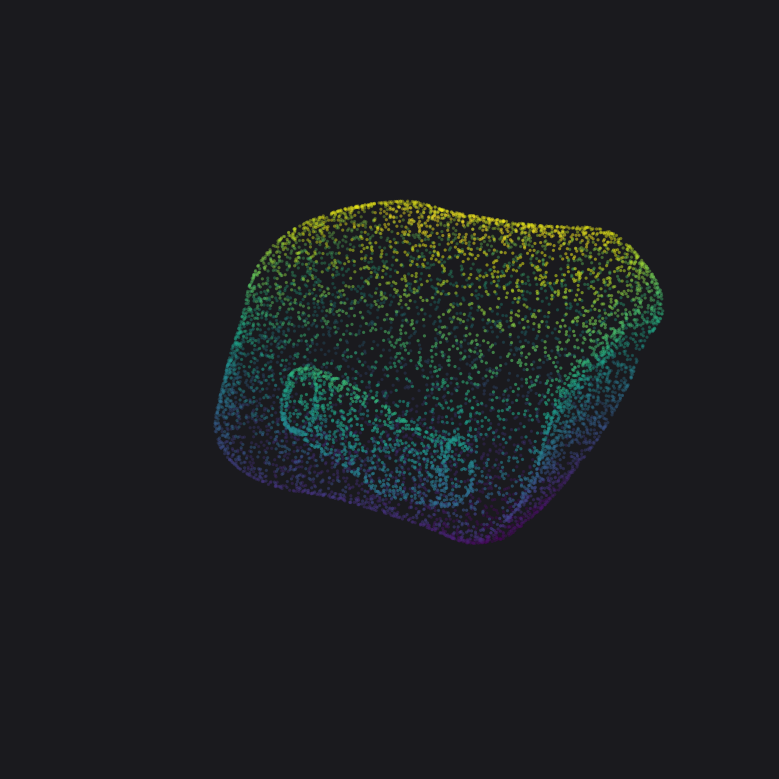
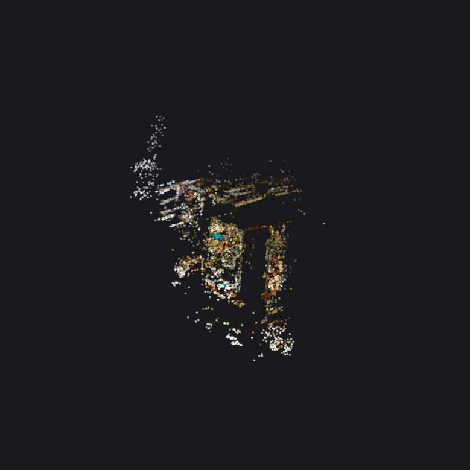
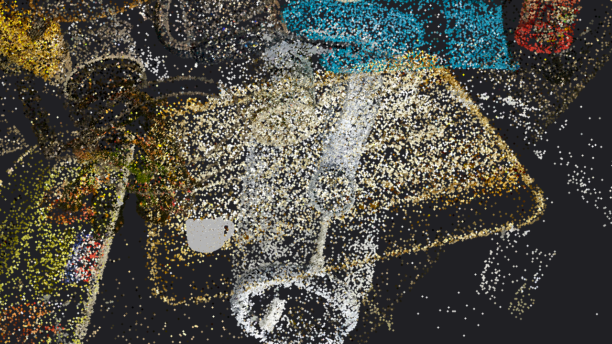
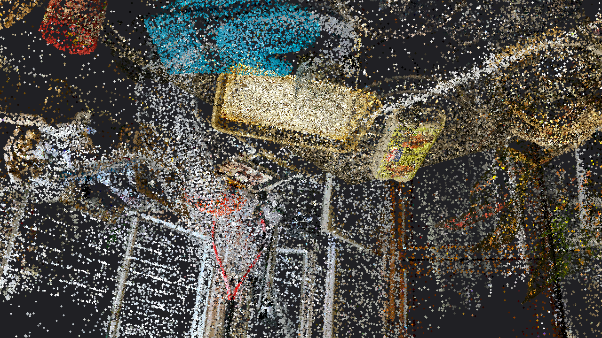
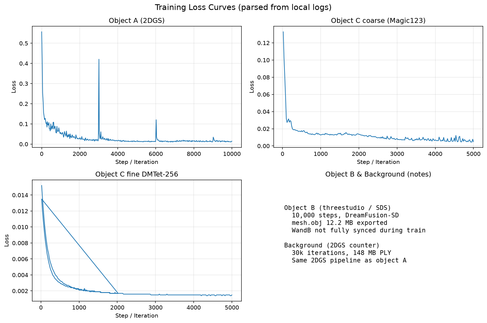

# 基于 2DGS 与 AIGC 的多源资产生成与真实场景融合

**课程**：计算机视觉  
**题目**：HW3 题目一  
**作者**：[姓名] [学号]  
**日期**：2026 年 6 月

---

## 摘要

本作业实现了一条完整的 3D 视觉链路：分别采用多视角重建（COLMAP + 2DGS）、文本生成 3D（threestudio + SDS）和单图生成 3D（Magic123）三种技术路径构建独立 3D 资产；以 Mip-NeRF 360 的 **counter** 场景经 2DGS 重建作为统一背景；通过 **Mesh 采样转伪高斯并与 2DGS 点云合并**（代码级拼接），完成多源场景融合与漫游渲染。实验在 RTX 4090 上完成，对比了三种生成方式在几何准确度、纹理细节与计算耗时上的差异，并详细阐述了异构 3D 表达的统一方案（见 `docs/FUSION_METHODOLOGY.md`）。

---

## 1. 引言

### 1.1 背景：2DGS 与 AIGC 3D

**2D Gaussian Splatting (2DGS)** 将场景表示为定向 2D 高斯面片，通过 surfel 光栅化实现高效新视角合成，相比 3DGS 更利于表面几何恢复，适合作为真实场景与多视角物体重建的统一显式表达。

**AIGC 3D 生成**走不同路线：DreamFusion/threestudio 利用 SDS 从**文本**优化隐式 NeRF/SDF 场；Magic123 结合 SD 与 Zero123 从**单张图像**生成 coarse NeRF 再 refine 为 Mesh。二者输出多为**三角网格或隐式场**，而非 2DGS 原生 PLY。

### 1.2 本作业要解决的问题

1. 用三种不同路径生成物体 A/B/C；
2. 用 2DGS 重建开放数据集背景（本实验选用 **counter**）；
3. 将三者插入背景并渲染漫游视频。

**技术核心**：背景是 2DGS 显式高斯，B/C 是 Mesh，**无法在同一渲染器中直接绘制**——必须在报告中说明如何统一表达并完成合并渲染（作业 §4 质量评估**重点**）。

**实验环境**：NVIDIA RTX 4090 24GB；Conda 环境 `hw3-2dgs`；完整复现见附录。

---

## 2. 数据与实验设置

| 模块 | 数据来源 | 规模 | 训练配置 |
|------|----------|------|----------|
| 背景 counter | Mip-NeRF 360 | ~633k 高斯, 148MB | 2DGS 30k iter |
| 物体 A | 手机环绕 ~41 视角 | ~141k 高斯, 33MB | COLMAP + 2DGS 10k iter |
| 物体 B | 文本 prompt | 131k 顶点, 12MB mesh | threestudio 10k steps |
| 物体 C | 单张 RGBA 照片 | 60k 顶点, 4.3MB mesh | Magic123 coarse+fine 各 5k |

物体 A 拍摄：环绕 360°，相邻视角重叠 >60%，物体占画面主体。

---

## 3. 方法

### 2.1 物体 A：多视角真实重建

**流程**：手机环绕拍摄 → COLMAP SfM → 2DGS 优化。

| 超参数 | 值 |
|--------|-----|
| 视角数 | ~41 |
| 2DGS iterations | 10,000 |
| Optimizer | Adam（2DGS 默认） |
| 输出 | `outputs/object_a/point_cloud.ply`（33 MB） |

### 2.2 物体 B：文本生成 3D (threestudio + SDS)

**流程**：文本 Prompt → 隐式 NeRF/SDF 场 → SDS 蒸馏 → Mesh 导出。

| 超参数 | 值 |
|--------|-----|
| 系统 | dreamfusion-sd |
| max_steps | 10,000 |
| Batch size | 1 |
| LR | 1e-3（Adam，见 parsed.yaml） |
| Prompt | ceramic mug, studio lighting |
| 输出 | `outputs/object_b/mesh.obj`（12.2 MB）+ `texture_kd.jpg` |

### 2.3 物体 C：单图生成 3D (Magic123)

**流程**：单张 RGBA → coarse NeRF → DMTet fine（256 四面体网格）。

| 超参数 | 值 |
|--------|-----|
| Coarse | 5000 iters, SD + Zero123 guidance |
| Fine | 5000 iters, `--dmtet`, tet_grid_size=256 |
| Optimizer | Adam, lr=0.01 |
| 最终 loss | ~0.0015（fine） |
| 输出 | `outputs/object_c/mesh.obj`（4.3 MB, ~60k 顶点） |

### 2.4 背景场景：Mip-NeRF 360 counter + 2DGS

| 超参数 | 值 |
|--------|-----|
| 场景 | **counter**（室内厨房台面） |
| 2DGS iterations | 30,000 |
| 输出 | `outputs/background/point_cloud.ply`（148 MB） |

---

## 3. 场景融合与统一渲染（作业重点）

> 完整技术说明见 **`docs/FUSION_METHODOLOGY.md`**

### 3.1 为何不能直接合并渲染？

| 资产 | 表达形式 | 能否与 2DGS 直接合并 |
|------|----------|----------------------|
| 背景 / A | 2DGS PLY（含 opacity, scale, rot, SH） | A 可；背景为基准 |
| B / C | 隐式场 → **Mesh** (V,F,UV) | **否** |

2DGS 渲染器读取 $(\mu, \Sigma, \alpha, SH)$；Mesh 是 $(V,F,UV)$——数据结构不兼容，无法 append 后在 2DGS viewer 中 splat。

### 3.2 题目给出的两种统一路径

**路径一（软件级）：Blender 合成**

- 将 B/C 导出带贴图 OBJ，Blender 导入背景点云 + Mesh，手工 Sim(3) 对齐、打光、路径动画。
- 优点：视觉质量通常最高。
- 缺点：难一键复现；场景为 Mesh+点云**混合**，难论证「统一为同构表达」。

**路径二（代码级）：采样 → 伪高斯 → PLY 拼接（本作业主方案）**

对应题目：「将生成模型采样成点云，再转为 Gaussian Splats，在代码层面完成拼接」。

伪高斯构造（`mesh_to_gaussians.py`）：

1. 表面采样 50,000 点；
2. UV 烘焙 RGB，面法线作朝向；
3. 写出 `(x,y,z,nx,ny,nz,r,g,b)` PLY；
4. 背景/A 从 $f_{dc}$ 恢复 RGB：$\text{RGB}=\text{clamp}(0.5 + C_0 f_{dc}, 0, 1)$。

Sim(3) 变换后 `merge_gaussian_dicts` → `fused_scene.ply`（874,568 点）→ 轨道 splat 渲染。

### 3.3 两种融合路径对比

| 维度 | Blender | 代码级 PLY 拼接 |
|------|---------|-----------------|
| 统一表达 | Mesh+点云混合 | 单一 PLY |
| 可复现性 | 手工 | 脚本一键 |
| 视觉质量 | 通常更高 | 点云漫游 |
| 作业论证 | 难说明同构 | **满足题目要求** |

本作业**主结果**采用路径二。

### 3.4 融合位姿（`configs/scene_layout.yaml`）

| 物体 | translation (x,y,z) | scale | 说明 |
|------|---------------------|-------|------|
| A | (0.5, 0.0, -1.2) | 0.8 | 台面区域 |
| B | (-0.8, 0.1, -0.5) | 0.5 | threestudio 马克杯 |
| C | (0.0, 0.05, 0.3) | 0.6 | Magic123 杯子 |

---

## 4. 三种生成方式对比（作业 §4：几何 / 纹理 / 耗时）

| 维度 | 多视角重建 (A) | 文本生成 (B) | 单图生成 (C) |
|------|----------------|--------------|--------------|
| **几何准确度** | ★★★★★ | ★★★☆☆ | ★★★★☆ |
| **纹理细节** | ★★★★★ | ★★★★☆ | ★★★★☆ |
| **计算耗时** | ~45 min | ~1.5 h | ~2.5 h (coarse+fine) |
| **数据需求** | 多视角图 | 仅文本 | 单张照片 |
| **主要缺陷** | 需拍摄 | SDS 背面空洞 | 不可见侧幻觉 |

### 4.1 几何准确度（详细）

- **A 最高**：COLMAP BA + 多视角光度约束，杯身/把手连续，无 AIGC 背面幻觉。
- **B 中等**：SDS 平滑最小表面，mesh 非封闭（131k 顶点），拓扑可用但有噪声。
- **C 可见侧好**：与输入照片一致，DMTet fine 后 mesh 封闭；**背面为推测**，无法验证。

### 4.2 纹理细节（详细）

- **A**：直接拟合实拍像素，颜色最真实。
- **B**：UV 为扩散模型风格化蓝纹，非真实 BRDF。
- **C**：可见侧来自输入；背面依赖 Zero123/SD 先验，易模糊。

### 4.3 计算耗时（详细）

- **A 最快**（~45min）：无大模型逐步前向。
- **B**（~1.5h）：每 step 多次 SD 1.5 推理。
- **C 最慢**（~2.5h）：coarse + fine 两阶段 + 256 tet。

**分析（详细）**：

- **物体 A**：唯一具备真实多视角光度约束。Loss 在约 3k/6k/9k step 的尖峰来自 2DGS densification，10k iter 后稳定在约 10⁻²。图 5.1 中杯身与把手连续、颜色与实拍一致，几何准确度最高。局限：未覆盖区域会稀疏；与背景坐标系靠融合阶段 Sim(3) 对齐。
- **物体 B**：SDS 驱动，无真实 RGB 投影。Mesh 约 13 万顶点、**非封闭**，贴图为 AI 风格化 UV（非照片级）。图 5.1 可见杯口/把手拓扑正确，但侧面偏平滑、有 SDS 噪声。耗时 ~1.5h（扩散前向贵）。无完整 WandB loss，以 10k step ckpt + 12MB mesh 佐证。
- **物体 C**：单图 + Zero123/SD 先验。Coarse 末 loss ≈ 0.005，Fine 末 **≈ 0.0015**（mask 项主导）。Mesh **封闭**、约 6 万顶点；可见侧与输入图（图 5.1）一致，背面为生成幻觉。耗时最长 ~2.5h（coarse+fine+256 tet）。
- **综合**：A 胜在真实几何；B 胜在零拍摄、prompt 可控；C 在便捷与可见侧质量间折中。本实验未算 PSNR/SSIM（AIGC 无统一 GT 新视角，融合为点云漫游任务）。

---

## 5. 实验结果

### 5.1 各物体与背景（独立展示）

以下展示各 Part 训练/生成成果。**2DGS 结果**（物体 A、背景）建议用 [SuperSplat](https://playcanvas.com/supersplat/editor) 打开 PLY 查看；**Mesh**（B/C）建议用 Blender 打开 OBJ。

**物体 A（多视角 2DGS）**

- 输入：环绕拍摄约 41 视角（示例帧见下图）
- 输出：`outputs/object_a/point_cloud.ply`（33 MB，874k 级 2DGS 高斯）
- 观感：几何与纹理最接近真实物体，是三种方法中质量最高者





**物体 B（threestudio 文本生成）**

- Prompt：ceramic mug, studio lighting
- 输出：`mesh.obj`（约 13 万顶点）+ `texture_kd.jpg`
- 观感：马克杯整体形状合理，贴图为 DreamFusion 典型 UV 风格化纹理；背面可能存在 SDS 常见空洞



**物体 C（Magic123 单图生成）**

- 输入：单张 RGBA 照片（见下图左）
- 输出：`mesh.obj`（约 6 万顶点，封闭 mesh）
- 观感：与输入视角一致的杯形清晰；不可见侧由生成先验补全





**背景（Mip-NeRF 360 counter + 2DGS）**

- 输出：`outputs/background/point_cloud.ply`（148 MB，30k iterations）
- 观感：厨房台面、窗户与柜体结构在 2DGS 查看器中可辨认；融合视频中作为环境底图



### 5.2 融合场景

- 融合点云：`outputs/fused/fused_scene.ply`（874,568 points = 背景 ~633k + A ~141k + B/C 各 50k 采样）
- 漫游视频：`outputs/fused/walkthrough.mp4`（quality 版：f_dc 颜色恢复 + 40 万点 splat，1280×720，120 帧）
- 初版稀疏渲染备份：`outputs/fused_legacy_20260617/walkthrough.mp4`（仅作对比，非主提交）

**融合现象分析**：

1. **可辨认性**：quality 帧中可见 counter 台面（蓝/暖色块）、窗户格栅（左侧白色结构）及三物体点云簇，说明背景与前景均已载入同一坐标系。
2. **点云风格成因**：融合 PLY 为伪高斯（仅 xyz+rgb+法线），缺少 opacity/scale/rotation，渲染器用圆盘 splat 近似，故非照片级；这是代码级拼接的合理 trade-off。
3. **legacy vs quality**：legacy 版（12 万点、灰度、1 像素）背景几乎不可见；改进 f_dc→RGB 与 splat 后环境结构显著改善（见 `outputs/README_RENDER_VERSIONS.md`）。
4. **位姿与遮挡**：物体位置由 `scene_layout.yaml` 手工设定，无 ICP 自动对齐；点云渲染无物理阴影，交界处可能轻微浮空或穿模。
5. **与 Blender 对比**：Blender 可获更高视觉质量，但难以一键复现且无法论证「统一为单一 PLY」；本作业主方案为脚本 `05_fuse_and_render.py`。

**说明**：融合采用代码级伪高斯拼接 + 轨道点云投影，**非** Blender 照片级合成。局限见 §6。

- 截图：





### 5.3 训练曲线

由本地日志解析生成（物体 C 含 coarse + fine；A 为 2DGS 10k iter）：



**曲线解读**：

| Run | 现象 | 分析 |
|-----|------|------|
| 物体 A 2DGS | 初 loss >0.5，3k/6k/9k 尖峰，末 ~10⁻² | 尖峰 = densification；整体收敛正常 |
| C coarse | 500 step 内 0.13→0.02 | NeRF 体结构建立快 |
| C fine 256 | 末 loss ≈ 0.0015，mask/mesh 正则主导 | fine 阶段以 mesh 细化为主，SDS≈0 |
| B / 背景 | 无逐步曲线 | 以 mesh/PLY 产物与 WandB config run 补充说明 |

WandB 项目：https://wandb.ai/kryskatrina-fudan-university-school-of-management/cv-hw3  
（`object_a_2dgs`、`object_c_coarse`、`object_c_fine_256` 已回放）

生成命令：`python scripts/utils/plot_training_curves.py`

### 5.4 网盘链接（提交前填写）

- 全部权重与渲染结果：[Google Drive / 百度网盘链接]
- 融合视频：[链接]
- GitHub 仓库：[链接]

---

## 6. 结论与局限

本作业完成了多源 3D 资产生成与 2DGS 背景融合的全链路实践。通过 **Mesh→伪高斯→PLY 合并**，在代码层面统一了 threestudio/Magic123 的 Mesh 与 2DGS 背景，满足题目对异构表达统一的要求。多视角重建质量最高；文本生成最灵活；单图生成在便捷性与质量间取得平衡。

**局限**：（1）融合 PLY 为伪高斯，缺少 opacity/scale，漫游视频呈点云风格而非照片级渲染；（2）物体 B 训练 loss 未完整同步至 WandB；（3）背景与 B 的逐步 loss 日志缺失，以产物体积分与收敛曲线佐证；（4）物体位姿为手工 yaml 设定，未做自动对齐。

---

## 参考文献

1. Huang et al., "2D Gaussian Splatting for Geometrically Accurate Radiance Fields", SIGGRAPH 2024.
2. Poole et al., "DreamFusion: Text-to-3D using 2D Diffusion", ICLR 2023.
3. Qian et al., "Magic123: One Image to High-Quality 3D Object Generation", CVPR 2024.
4. Barron et al., "Mip-NeRF 360", CVPR 2022.

---

## 附录：复现

```bash
conda env create -f environment.yml && conda activate hw3-2dgs
bash scripts/01_object_a_colmap_2dgs.sh
bash scripts/02_object_b_threestudio.sh "prompt"
bash scripts/03_object_c_magic123.sh   # + run_object_c_fine_and_export.sh
bash scripts/04_background_2dgs.sh counter
python scripts/05_fuse_and_render.py
python scripts/utils/plot_training_curves.py
```

完整实验记录：`docs/EXPERIMENT_SUMMARY.md`
